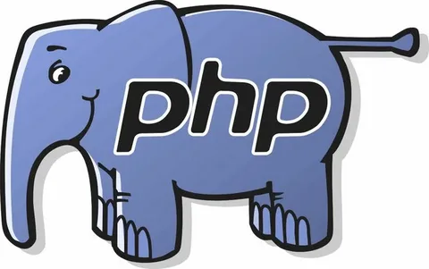
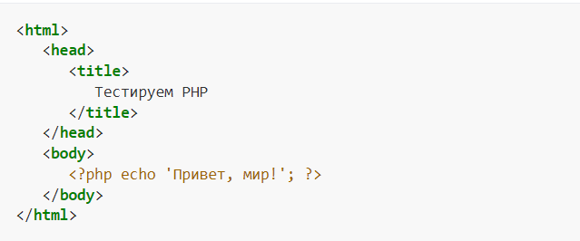
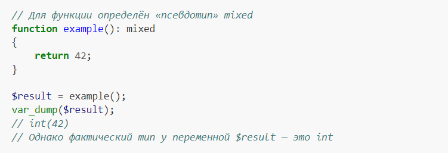
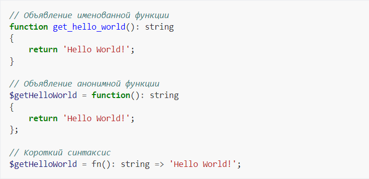
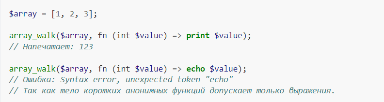

# PHP

## PHP (англ. PHP: Hypertext Preprocessor — «PHP: препроцессор гипертекста»; первоначально PHP/FI (Personal Home Page / Form Interpreter), а позже названный Personal Home Page Tools[9] — «Инструменты для создания персональных веб-страниц») — скриптовый язык[10] общего назначения, интенсивно применяемый для разработки веб-приложений. В настоящее время поддерживается подавляющим большинством хостинг-провайдеров и является одним из лидеров среди языков, применяющихся для создания динамических веб-сайтов[11].
## Язык и его интерпретатор (Zend Engine) разрабатываются группой энтузиастов в рамках проекта с открытым кодом[12]. Проект распространяется под собственной лицензией, несовместимой с GNU GPL.
# Область применения
## В области веб-программирования, в частности, серверной части, PHP — один из популярных сценарных языков (наряду с JSP, Perl и языками, используемыми в ASP.NET).

## Популярность в области построения веб-сайтов определяется наличием большого набора встроенных средств и дополнительных модулей для разработки веб-приложений[13]. Основные из них:

## Автоматическое извлечение POST- и GET-параметров, а также переменных окружения веб-сервера в предопределённые массивы;

## До версии 7.0 допускалось использование ограничителей языка программирования ASP <% %>. Работа сокращённых конструкций определяется в конфигурационном файле php.ini.
## Имена переменных начинаются с символа $, тип переменной объявлять не нужно. Имена переменных и констант чувствительны к регистру символов. Имена классов, методов классов и функций к регистру символов не чувствительны. Переменные обрабатываются в строках, заключённых в двойные кавычки, и heredoc-строках (строках, созданных при помощи оператора <<<). Переменные в строках, заключённых в одинарные кавычки и nowdoc не обрабатываются.

# Функции
## PHP поддерживает как объявление именованных функций, так и анонимных функций первого класса, например:

## Стоит обратить внимание, что в случае анонимных функций различие состоит не только в визуальных отличиях, но и в способе захвата переменных внешнего контекста. Любая «короткая» форма записи является замыканием, в то же время длинная запись для реализации замыкания требует явного указания переменных внутри оператора use из внешнего контекста для их захвата:
## Обращение к переменным осуществляется с помощью символа $, за которым следует имя переменной. Данная конструкция может быть применена также для создания динамических переменных и функций.
## В PHP echo и print хоть и выглядят похоже на функции, однако первое является оператором[64], а второе выражением (то есть print возвращает значение, в отличие от echo). При их использовании можно опустить скобки.

